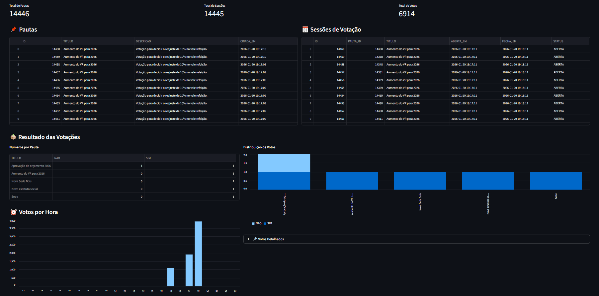

# API de Votação Cooperativa
`Java` `Spring Boot` `Oracle` `Redis` `Streamlit` `Docker` `Gradle` `API REST` `OpenAPI`

Uma solução para gerenciar pautas, sessões de votação e votos em um sistema de cooperativismo. Cada associado possui um voto, e as decisões são tomadas através de assembleias virtuais.

O projeto utiliza **Java (Spring Boot)** para a API, **Oracle** como banco de dados, **Redis** para cache e fila de sessões, e um **Dashboard em Python** para visualização de dados.

---

## 🛠️ Tecnologias e Stack

**Backend:**
- Java 11
- Spring Boot
- Spring Data JPA / Hibernate
- Gradle
- Oracle Database
- Redis

**Frontend / Dashboard:**
- Python 3
- Streamlit
- Pandas
- Matplotlib / Plotly

**Outros:**
- Docker / Docker Compose
- OpenAPI 3.0
---

## 🚀 Como Rodar

### Construir artefato
Executar o comando abaixo para executar testes e gerar o jar executável do Spring boot:
```
 ./gradlew clean build
```

### Executar Docker Compose
Rodar o docker-compose para subir toda a infra e o serviço:
```
docker-compose up --build -d
```

### Mostrar logs do serviço
Rodar o comando abaixo para visualizar os logs do serviço:
```
docker logs -f votacaoapp
```

### Swagger
Abrir a seguinte URL no browser para visualizar o Swagger UI:
```
http://localhost:8080/swagger-ui/index.html
```

### Destruir o serviço
```
docker-compose down
```
---

## 📡 Endpoints da API

Base URL: `http://localhost:8080/api/v1`

---

### 🔹 Pautas

| Método | Endpoint | Descrição |
|--------|----------|-----------|
| POST   | `/pautas` | Cadastrar nova pauta |
| POST   | `/pautas/{pautaId}/sessao` | Abrir sessão de votação |
| GET    | `/pautas/{pautaId}/resultado` | Obter resultado da votação |

#### 1️⃣ POST `/pautas` – Cadastrar nova pauta
**Request:**
```json
{
  "titulo": "Aumento do VR para 2026",
  "descricao": "Votação para decidir o reajuste de 10% no vale refeição."
}
```

**Response 201 Created:**
```json
{
  "id": 1,
  "titulo": "Aumento do VR para 2026",
  "descricao": "Votação para decidir o reajuste de 10% no vale refeição.",
  "criadaEm": "2026-01-21T12:00:00Z"
}
```

**Response 400 Bad Request:**  
Dados inválidos.

---

#### 2️⃣ POST `/pautas/{pautaId}/sessao` – Abrir sessão de votação
**Request:**
```json
{
  "minutos": 5
}
```
- `minutos` é opcional, padrão 1 minuto.

**Response 200 OK:**
```json
{
  "id": 1,
  "pautaId": 1,
  "abertaEm": "2026-01-21T12:05:00Z",
  "fechaEm": "2026-01-21T12:10:00Z",
  "status": "ABERTA"
}
```

**Response 404 Not Found:**  
Pauta não encontrada.

**Response 400 Bad Request:**  
Sessão já existente ou dados inválidos.

---

#### 3️⃣ GET `/pautas/{pautaId}/resultado` – Obter resultado
**Response 200 OK:**
```json
{
  "pautaId": 1,
  "resultado": {
    "SIM": 12,
    "NAO": 3
  }
}
```

**Response 404 Not Found:**  
Pauta não encontrada.

---

### 🔹 Votos

| Método | Endpoint | Descrição |
|--------|----------|-----------|
| POST   | `/pautas/{pautaId}/votos` | Registrar voto na pauta |

#### 4️⃣ POST `/pautas/{pautaId}/votos` – Registrar voto
**Request:**
```json
{
  "cpf": "12345678901",
  "voto": "SIM"
}
```

**Response 201 Created:**  
Voto registrado com sucesso.

**Response 400 Bad Request:**  
Voto duplicado ou sessão encerrada.

**Response 404 Not Found:**  
Pauta ou sessão não encontrada.

---

## 📊 Dashboard (Streamlit)
````html
http://localhost:8501/
````

Exemplo de funcionalidades:
- Tabela de Pautas
- Tabela de Sessões 
- Tabela de Resultados des Votações
- Grafico de Votos por Sessão
- Gradico de Votos por Hora
- Tabela de Votos Detalhada



---